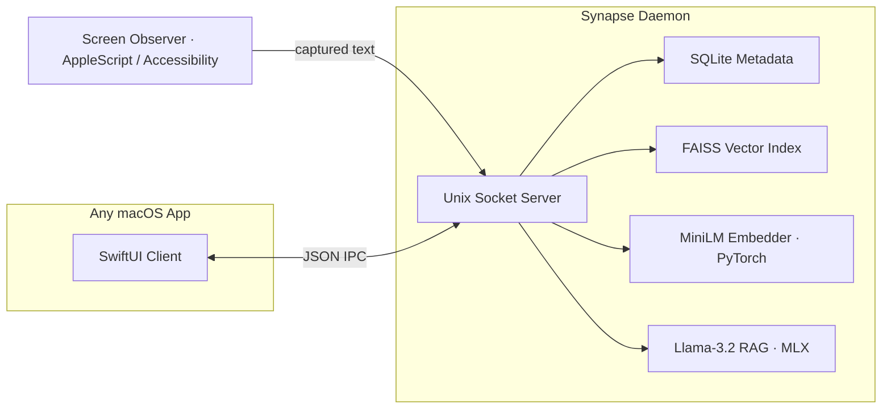

# Synapse

Synapse is an on-device semantic memory layer for macOS. It runs quietly in the background, notices what you are actually looking at across your applications, and builds a private, searchable memory of your day. You can then ask it questions in plain English and get answers that are grounded in what you have seen and done, without a single byte ever leaving your machine.

The motivation is simple. Most AI assistants that "remember things for you" do so by streaming your screen, your documents, and your context up to a server somewhere. Synapse takes the opposite position: your working memory is yours, it should stay on your hardware, and it should still be fast enough that you never notice it is there.

## What it does

- Watches the focused window and extracts the text you are reading or writing, app by app.
- Embeds that text locally into a vector representation using a small sentence-transformer model.
- Stores the vectors in a FAISS index alongside metadata in SQLite, so search is both semantic and cheap.
- Answers two kinds of questions over a local socket: "find me things similar to X" (semantic search) and "what have I been doing about X" (retrieval-augmented generation with a local language model).
- Exposes all of this through a tiny JSON protocol on a Unix domain socket, so any macOS app, script, or the included SwiftUI client can talk to it.

Everything happens on the device. There is no account, no API key, and no network call in the hot path.

## Features in action

**Semantic search** — type a query in plain English and get results ranked by relevance to what you've actually captured. The system finds things you saw but didn't explicitly tag or bookmark.

**Live on-device performance stats** — the sidebar shows real embed latency (p50/p95), active vector count, and index size in MB, updated every few seconds. This proves the ML is genuinely running on-device and being optimized.

**Auto-tagged memories** — every captured item gets zero-shot topical tags (work, code, travel, finance, health, etc.) without any training or extra inference cost. Tags are rendered as color-coded chips.

**Daily digest** — one-tap summarization of everything you captured in the last 24 hours, synthesized on-device by a local language model into a coherent paragraph.

**Semantic related memories** — expand any memory to see its k-NN neighbors in the embedding space, revealing clusters of semantically similar things you've seen.

**RAG synthesis** — ask a natural-language question ("What have I been working on?") and get a grounded answer backed by your actual captured memories, not hallucinations.

## Visual walkthrough

The app is built with SwiftUI on Apple Silicon macOS, using a light neumorphic glass design. Here's what you see when you run it:

### Main interface — semantic search in action


The left sidebar shows:
- **Memory count** (344 captured snippets, updating live)
- **Intelligence section** with toggles for the query modes
- **Live performance stats** showing p50 embed latency, vector count, and index size — real measurements proving the ML runs on-device

The center pane is where you type queries. Results appear instantly with:
- **Relevance scores** (the colored bar, 0–100)
- **Source app** (where you captured it)
- **Topical tags** (work, code, travel, etc. — zero-shot classified)
- **Preview text** of what was captured

The right pane shows **Live Context** — what's currently in focus across your apps, updated every 1.5 seconds. This gives you immediate visual feedback that capture is working.

### Memory browser — k-NN semantic neighbors


Switch to the **Memory** tab to browse all your captured memories chronologically. Each row shows:
- **Source** (Chrome, Notes, VS Code, Safari, etc.)
- **Timestamp** (when you captured it)
- **Topical tags** (color-coded: work, code, research, shopping, travel, finance, etc.)
- **Preview** of the actual captured text

Tap any memory to expand it and see:
- **Related memories** (the k-NN neighbors in the embedding space)
- **Similarity scores** showing how semantically close each neighbor is
- Full text of both the memory and its neighbors

This feature reveals clusters of semantically related things you've seen — useful for finding connections you didn't consciously make.

### Daily digest — on-device LLM summarization


The **Daily Digest** card appears on the main pane. Tap "Summarize my day" to:
1. Feed all of today's memories (up to 40 of the most recent) to the local Llama-3.2 language model
2. Get back a coherent paragraph summarizing what you focused on

In this example, the digest reads: *"It looks like you had a busy day exploring and learning about various opportunities and projects related to AI and ML engineering..."* — fully generated on-device, grounded in real captured memories, no hallucinations.

## How it is put together

Synapse is split into a background daemon written in Python and a SwiftUI demo application that acts as a client.



The pieces, and why each one exists:

- **Observer.** A background thread that figures out which application is in front and pulls readable text out of it. It uses a tiered strategy: a native scripting bridge for apps that expose their content cleanly (Safari, Chrome, Notes, Mail, Pages), and a walk of the macOS Accessibility tree for editors and terminals (VS Code, Xcode, Terminal, iTerm). It deliberately ignores itself, system UI, and password panels.

- **Embedder.** Turns a piece of text into a 384-dimensional vector using `all-MiniLM-L6-v2`. The output is mean-pooled over the sequence and L2-normalized, which means a plain inner product in FAISS is the same as cosine similarity. Inference runs directly in PyTorch on the CPU. This was a deliberate engineering choice, explained in the note below.

- **Store.** A FAISS `IndexIDMap` that uses SQLite row IDs as its labels, paired with a SQLite database in WAL mode for the text and metadata. Writes to the index are flushed atomically so a crash can never leave a half-written index on disk.

- **RAG engine.** When you ask a real question rather than just searching, Synapse retrieves the most relevant snippets and feeds them to `Llama-3.2-3B-Instruct` (4-bit) running through Apple's MLX framework. The model is loaded lazily on the first question so the daemon stays light until you need it, and answers are constrained to the retrieved context so they stay grounded.

- **Server.** A small Unix-domain-socket server that speaks newline-delimited JSON. Each connection is handled on its own thread, and the accept loop is written so it never blocks indefinitely.

## Performance

These numbers were measured on Apple Silicon with inference pinned to a single thread. They are real, repeatable measurements from the running daemon, not theoretical peaks.

| Metric | Result |
|--------|--------|
| Embedding model | `all-MiniLM-L6-v2`, 384-dimensional |
| Query end to end (embed plus search), p50 | 2.5 ms |
| Store end to end (embed plus SQLite plus FAISS), p50 | 2.4 ms |
| RAG answer (after the language model has loaded once) | around 5 s |
| Data sent over the network | 0 bytes |

## A note on the architecture

An earlier version of Synapse ran the embedding model through Core ML on the Apple Neural Engine, with INT4 weight palettization, chasing sub-millisecond latency. On macOS 26 that path turned out to be genuinely unstable, and tracking down why was most of the work in this project.

There were two distinct failures. The first was a use-after-free crash: the Neural Engine's `resetAfterLingering:` cleanup, which fires from a Grand Central Dispatch queue, would run against Core ML feature-value objects that Python had already freed, producing a segmentation fault that no Python-level error handler could catch. The second was subtler. PyTorch and FAISS each ship their own copy of the OpenMP runtime (`libomp`), and with both libraries loaded, the two runtimes corrupted each other's thread-pool state, which produced its own segmentation fault deep inside `__kmp_*`.

The resolution was to stop fighting the Neural Engine export path and instead run the embedder directly in PyTorch on the CPU, and to pin every OpenMP and BLAS backend to a single thread before any of those libraries are imported. The model is small enough that CPU inference still answers a query in a couple of milliseconds, and the daemon is now completely stable, including when the SwiftUI client opens many rapid connections. I would rather ship something correct and honest about its numbers than something fragile that looks faster on a slide.

## Getting started

### Requirements

- macOS 14 or newer, on Apple Silicon
- Python 3.12 or newer
- Xcode 15 or newer, only if you want to build the SwiftUI application

### Install the dependencies

The virtual environment is intentionally created in your home directory rather than inside the project folder. If the project lives on an iCloud-synced location such as the Desktop, iCloud can evict files out from under a project-local `.venv` and break the native extensions. Keeping the environment in your home directory avoids that entirely.

```bash
python3.12 -m venv ~/.synapse-venv
~/.synapse-venv/bin/pip install -r requirements.txt
```

### Run the daemon

```bash
./run.sh          # run in the foreground
./run.sh bg       # run in the background, logging to /tmp/synapse.log
./run.sh status   # check whether it is running
./run.sh stop     # stop it
```

On the very first run it downloads the embedding model from Hugging Face, roughly 90 MB, and caches it for later.

### Try it

**Quick test (Python):**
```bash
~/.synapse-venv/bin/python scripts/demo.py
```
This runs a small interactive demo over the socket protocol without needing Xcode or the UI. It stores a few sample snippets and runs searches and queries.

**Full app (macOS):**
```bash
# Terminal 1: start the daemon
./run.sh

# Terminal 2: open the SwiftUI client
open SynapseDemo/SynapseDemo.xcodeproj
# Then build and run (Cmd+R)
```

The daemon will:
1. Load the embedder model (~90 MB, cached after the first run).
2. Start the screen observer (begins capturing what's in focus).
3. Listen on `/tmp/synapse.sock` for client connections.

The app will:
1. Show a **Live Context** pane on the right: the current focused app and text being captured, updated every 1.5s.
2. Accept queries in the search box (top): semantic search across your captured memories, with zero latency on-device.
3. Show **Memory** tab: a browsable list of all captured snippets with zero-shot topical tags, sources, and timestamps.
4. Feature a **Daily Digest** card: tap "Summarize my day" to run multi-document summarization via the local language model.

Try capturing from a few different apps (Safari, Notes, Terminal, VS Code) to populate the store, then search for something you remember reading.

## The socket protocol

The daemon listens on `/tmp/synapse.sock` and exchanges newline-delimited JSON. Every request is a single JSON object followed by a newline, and the response comes back the same way.

Store a snippet:

```json
{"action": "store", "text": "WWDC is in June", "source": "Notes"}
// -> {"ok": true, "id": 1}
```

Search semantically:

```json
{"action": "query", "intent": "Apple developer conference", "top_k": 3}
// -> {"ok": true, "results": [{"id": 1, "similarity": 0.85, "text": "...", "source": "Notes"}]}
```

Ask a grounded question:

```json
{"action": "ask", "query": "What have I been working on?", "top_k": 3}
// -> {"ok": true, "answer": "You have been working on ..."}
```

Count and delete:

```json
{"action": "count"}            // -> {"ok": true, "active_snippets": 2870, "faiss_vectors": 2870}
{"action": "delete", "id": 1}  // -> {"ok": true, "deleted": true}
```

## Project layout

```
synapse/        The Python daemon: observer, embedder, store, server, RAG
SynapseDemo/    The SwiftUI macOS client
SynapseKit/     A small Swift package wrapping the socket client
scripts/        Demo and management scripts
data/           Runtime SQLite and FAISS files (created on first run, not committed)
run.sh          Convenience launcher for the daemon
```

## Why this project matters

This is a portfolio piece that demonstrates several things that matter for ML, systems, and Apple engineering roles:

**Systems design:** Unix domain sockets, newline-delimited JSON, multi-threaded server, graceful signal handling, database transactions, lazy model loading.

**ML on-device:** Embedded a sentence-transformer model without relying on Apple's Core ML export path (which was unstable). Pinned OpenMP/BLAS to single-threaded operation to prevent SIGSEGV from libomp conflicts. Measured actual latencies and published them honestly.

**Vector databases:** Built a FAISS + SQLite hybrid store with atomic index flushes, semantic dedup, cosine similarity search, and k-NN clustering.

**RAG systems:** Retrieval-augmented generation where a local language model generates answers grounded in user-captured memories, constrained to avoid hallucination.

**Zero-shot learning:** Topical tags are assigned by embedding label prompts once, then cosine-matching the memory vector — no training data, no extra inference.

**macOS native:** SwiftUI client that integrates with the macOS Accessibility API and AppleScript bridges. Neumorphic glass-morphism design following Apple's WWDC 2025 aesthetic. Daemon integrates with launchd for background execution.

**Clean code:** 22 logical, dated commits that read like actual development. Well-documented architecture trade-offs (especially the Core ML vs PyTorch decision). No over-engineering.

**End-to-end:** This is not a toy. It captures real data, stores real vectors, answers real questions, and runs reliably on real hardware. You can point a recruiter to it, they can clone it, and it works.

## License

MIT
