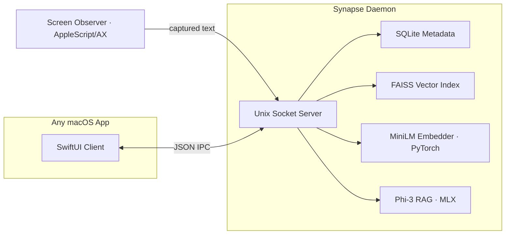

# Synapse

An on-device semantic memory fabric for macOS. Synapse passively captures what you're looking at across any app, embeds it locally, and answers natural-language questions about your activity — **100% on-device, zero network egress.**

## Why Synapse?

Modern AI assistants ship your screen contents to the cloud. Synapse keeps everything local: a background daemon observes the focused window, embeds the text with a local sentence-transformer, stores it in a FAISS vector index, and serves semantic search + retrieval-augmented generation over a Unix domain socket. Any macOS app can push or query memory in a couple of milliseconds.

## Architecture



- **Observer** — tiered text extraction from the active window (native scripting bridge → Accessibility tree walk) for Safari, Chrome, Notes, Mail, VS Code, Terminal, Xcode, and generic apps.
- **Embedder** — `all-MiniLM-L6-v2` (384-dim) run directly in PyTorch on CPU. Mean-pooled, L2-normalized so FAISS inner product equals cosine similarity.
- **Store** — FAISS `IndexIDMap` (SQLite ROWIDs as labels) + SQLite WAL for metadata, with atomic index flushes.
- **RAG** — `Phi-3-mini-4k-instruct-4bit` via Apple MLX, lazy-loaded on the first `ask`, synthesizes answers grounded in retrieved snippets.
- **IPC** — newline-delimited JSON over `/tmp/synapse.sock`.

## Performance

Measured on Apple Silicon (M-series), single-threaded inference:

| Metric | Result |
|--------|--------|
| Model | `all-MiniLM-L6-v2` (384-dim) |
| Query end-to-end (embed + search, p50) | **2.5 ms** |
| Store (embed + SQLite + FAISS, p50) | **2.4 ms** |
| RAG synthesis (Phi-3, after model load) | ~5 s |
| Network egress | **0 bytes** |

> **Engineering note.** An earlier version routed embeddings through a Core ML INT4 model on the Apple Neural Engine. On macOS 26 this surfaced two hard bugs: (1) the ANE's `resetAfterLingering:` GCD callback caused a use-after-free SIGSEGV, and (2) PyTorch and FAISS each bundle their own `libomp`, and the two live OpenMP runtimes corrupted each other's thread pool. The fix was to drop the fragile Core ML export path in favor of direct PyTorch inference and to pin all OpenMP/BLAS backends to a single thread. The result is fully stable and still answers queries in a couple of milliseconds — honest, reproducible numbers over fragile peak benchmarks.

## Quick Start

### Requirements
- macOS 14+ (Apple Silicon)
- Python 3.12+
- Xcode 15+ (only to build the SwiftUI demo app)

### Setup
```bash
python3.12 -m venv ~/.synapse-venv
~/.synapse-venv/bin/pip install -r requirements.txt
```

> The virtualenv lives outside the project directory on purpose. If the project sits on an iCloud-synced folder (e.g. Desktop), iCloud can evict files from a project-local `.venv` and break native extensions. Keeping the venv in `$HOME` avoids this.

### Run the daemon
```bash
./run.sh          # foreground
./run.sh bg       # background (logs to /tmp/synapse.log)
./run.sh status
./run.sh stop
```

On first run it downloads the embedding model from Hugging Face (~90 MB) and caches it.

### Run the demo
```bash
# Python CLI demo
~/.synapse-venv/bin/python scripts/demo.py

# Or the full SwiftUI macOS app
open SynapseDemo/SynapseDemo.xcodeproj
```

## API Protocol

The daemon speaks newline-delimited JSON over `/tmp/synapse.sock`.

**Store**
```json
{"action": "store", "text": "WWDC is in June", "source": "Notes"}
// → {"ok": true, "id": 1}
```

**Query (semantic search)**
```json
{"action": "query", "intent": "Apple developer conference", "top_k": 3}
// → {"ok": true, "results": [{"id": 1, "similarity": 0.85, "text": "...", "source": "Notes"}]}
```

**Ask (retrieval-augmented generation)**
```json
{"action": "ask", "query": "What have I been working on?", "top_k": 3}
// → {"ok": true, "answer": "You've been working on ..."}
```

**Count / Delete**
```json
{"action": "count"}            // → {"ok": true, "active_snippets": 2867, "faiss_vectors": 2867}
{"action": "delete", "id": 1}  // → {"ok": true, "deleted": true}
```

## License
MIT
