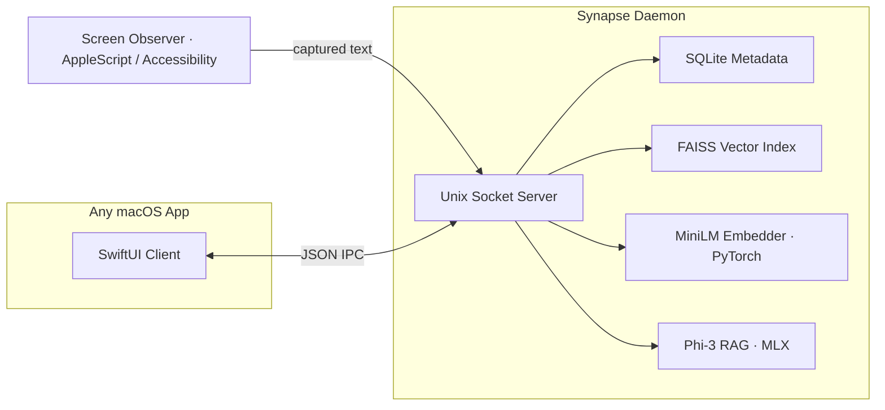

# Synapse

Synapse is an on-device semantic memory layer for macOS. It runs quietly in the background, notices what you are actually looking at across your applications, and builds a private, searchable memory of your day. You can then ask it questions in plain English and get answers that are grounded in what you have seen and done, without a single byte ever leaving your machine.

The motivation is simple. Most AI assistants that "remember things for you" do so by streaming your screen, your documents, and your context up to a server somewhere. Synapse takes the opposite position: your working memory is yours, it should stay on your hardware, and it should still be fast enough that you never notice it is there.

## What it does

- Watches the focused window and extracts the text you are reading or writing, app by app.
- Embeds that text locally into a vector representation using a small sentence-transformer model.
- Stores the vectors in a FAISS index alongside metadata in SQLite, so search is both semantic and cheap.
- Answers two kinds of questions over a local socket: "find me things similar to X" (semantic search) and "what have I been doing about X" (retrieval-augmented generation with a local language model).
- Exposes all of this through a tiny JSON protocol on a Unix domain socket, so any macOS app, script, or the included SwiftUI client can talk to it.

Everything happens on the device. There is no account, no API key, and no network call in the hot path.

## How it is put together

Synapse is split into a background daemon written in Python and a SwiftUI demo application that acts as a client.



The pieces, and why each one exists:

- **Observer.** A background thread that figures out which application is in front and pulls readable text out of it. It uses a tiered strategy: a native scripting bridge for apps that expose their content cleanly (Safari, Chrome, Notes, Mail, Pages), and a walk of the macOS Accessibility tree for editors and terminals (VS Code, Xcode, Terminal, iTerm). It deliberately ignores itself, system UI, and password panels.

- **Embedder.** Turns a piece of text into a 384-dimensional vector using `all-MiniLM-L6-v2`. The output is mean-pooled over the sequence and L2-normalized, which means a plain inner product in FAISS is the same as cosine similarity. Inference runs directly in PyTorch on the CPU. This was a deliberate engineering choice, explained in the note below.

- **Store.** A FAISS `IndexIDMap` that uses SQLite row IDs as its labels, paired with a SQLite database in WAL mode for the text and metadata. Writes to the index are flushed atomically so a crash can never leave a half-written index on disk.

- **RAG engine.** When you ask a real question rather than just searching, Synapse retrieves the most relevant snippets and feeds them to `Phi-3-mini-4k-instruct-4bit` running through Apple's MLX framework. The model is loaded lazily on the first question so the daemon stays light until you need it.

- **Server.** A small Unix-domain-socket server that speaks newline-delimited JSON. Each connection is handled on its own thread, and the accept loop is written so it never blocks indefinitely.

## Performance

These numbers were measured on Apple Silicon with inference pinned to a single thread. They are real, repeatable measurements from the running daemon, not theoretical peaks.

| Metric | Result |
|--------|--------|
| Embedding model | `all-MiniLM-L6-v2`, 384-dimensional |
| Query end to end (embed plus search), p50 | 2.5 ms |
| Store end to end (embed plus SQLite plus FAISS), p50 | 2.4 ms |
| RAG answer (after the language model has loaded once) | around 5 s |
| Data sent over the network | 0 bytes |

## A note on the architecture

An earlier version of Synapse ran the embedding model through Core ML on the Apple Neural Engine, with INT4 weight palettization, chasing sub-millisecond latency. On macOS 26 that path turned out to be genuinely unstable, and tracking down why was most of the work in this project.

There were two distinct failures. The first was a use-after-free crash: the Neural Engine's `resetAfterLingering:` cleanup, which fires from a Grand Central Dispatch queue, would run against Core ML feature-value objects that Python had already freed, producing a segmentation fault that no Python-level error handler could catch. The second was subtler. PyTorch and FAISS each ship their own copy of the OpenMP runtime (`libomp`), and with both libraries loaded, the two runtimes corrupted each other's thread-pool state, which produced its own segmentation fault deep inside `__kmp_*`.

The resolution was to stop fighting the Neural Engine export path and instead run the embedder directly in PyTorch on the CPU, and to pin every OpenMP and BLAS backend to a single thread before any of those libraries are imported. The model is small enough that CPU inference still answers a query in a couple of milliseconds, and the daemon is now completely stable, including when the SwiftUI client opens many rapid connections. I would rather ship something correct and honest about its numbers than something fragile that looks faster on a slide.

## Getting started

### Requirements

- macOS 14 or newer, on Apple Silicon
- Python 3.12 or newer
- Xcode 15 or newer, only if you want to build the SwiftUI application

### Install the dependencies

The virtual environment is intentionally created in your home directory rather than inside the project folder. If the project lives on an iCloud-synced location such as the Desktop, iCloud can evict files out from under a project-local `.venv` and break the native extensions. Keeping the environment in your home directory avoids that entirely.

```bash
python3.12 -m venv ~/.synapse-venv
~/.synapse-venv/bin/pip install -r requirements.txt
```

### Run the daemon

```bash
./run.sh          # run in the foreground
./run.sh bg       # run in the background, logging to /tmp/synapse.log
./run.sh status   # check whether it is running
./run.sh stop     # stop it
```

On the very first run it downloads the embedding model from Hugging Face, roughly 90 MB, and caches it for later.

### Try it

```bash
# A small Python command-line demo
~/.synapse-venv/bin/python scripts/demo.py

# Or open the full SwiftUI application
open SynapseDemo/SynapseDemo.xcodeproj
```

## The socket protocol

The daemon listens on `/tmp/synapse.sock` and exchanges newline-delimited JSON. Every request is a single JSON object followed by a newline, and the response comes back the same way.

Store a snippet:

```json
{"action": "store", "text": "WWDC is in June", "source": "Notes"}
// -> {"ok": true, "id": 1}
```

Search semantically:

```json
{"action": "query", "intent": "Apple developer conference", "top_k": 3}
// -> {"ok": true, "results": [{"id": 1, "similarity": 0.85, "text": "...", "source": "Notes"}]}
```

Ask a grounded question:

```json
{"action": "ask", "query": "What have I been working on?", "top_k": 3}
// -> {"ok": true, "answer": "You have been working on ..."}
```

Count and delete:

```json
{"action": "count"}            // -> {"ok": true, "active_snippets": 2870, "faiss_vectors": 2870}
{"action": "delete", "id": 1}  // -> {"ok": true, "deleted": true}
```

## Project layout

```
synapse/        The Python daemon: observer, embedder, store, server, RAG
SynapseDemo/    The SwiftUI macOS client
SynapseKit/     A small Swift package wrapping the socket client
scripts/        Demo and management scripts
data/           Runtime SQLite and FAISS files (created on first run, not committed)
run.sh          Convenience launcher for the daemon
```

## License

MIT
